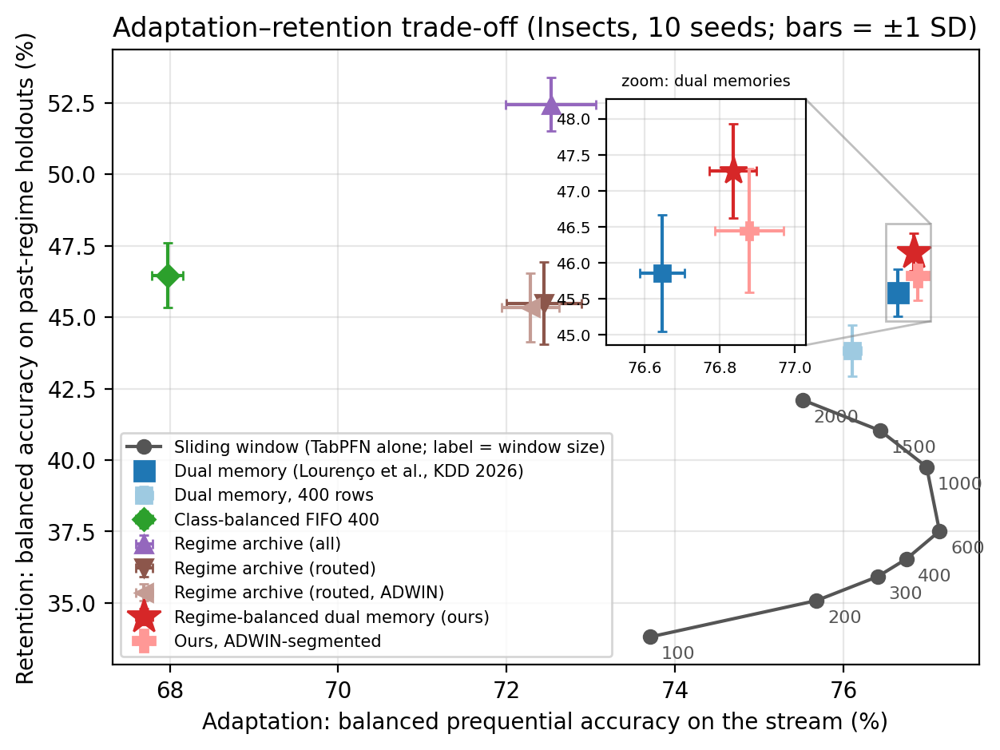
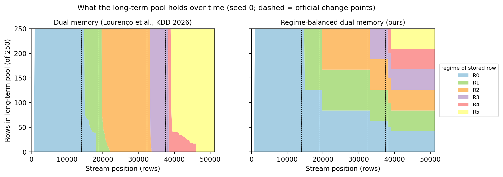
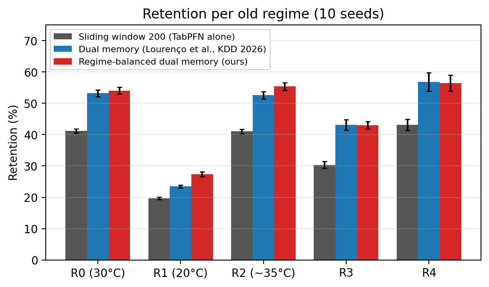

# Adaptation and Forgetting of Tabular Foundation Models under Temporal Shifts

*A study of context memory for a frozen TabPFN on concept-drift data streams*

Master's thesis project, KTH Royal Institute of Technology · Wenbo Xia · [中文版](#中文版)

---

## Summary

A frozen tabular foundation model such as TabPFN never updates its weights. It "learns" a data stream only through the rows placed in its context. The common choice, the most recent rows, adapts quickly to a new regime but forgets the earlier ones. This project measures that forgetting on a real concept-drift stream and compares 16 ways of choosing the context.

| Context policy (TabPFN frozen in all rows) | Context rows | Adaptation (%) | Retention (%) |
|---|---|---|---|
| Sliding window (default baseline) | 200 | 75.68 | 35.08 |
| Sliding window, same budget | 1 000 | 76.99 | 39.76 |
| Dual memory of Lourenço et al., KDD 2026 (our reimplementation: 75 % short-term) | 1 000 | 76.65 | 45.86 |
| **Regime-balanced dual memory (this work)** | 1 000 | **76.84** | **47.27** |
| Same, with regimes found by ADWIN instead of the official change points | 1 000 | 76.88 | 46.45 |

*Insects `abrupt_balanced` stream, 6 classes, balanced accuracy (chance = 16.7 %), mean over 10 seeds. Adaptation = accuracy on the stream; retention = accuracy on held-out data of earlier regimes.*

- Retention is **12.19 pp higher** than the 200-row window and 7.51 pp higher than a 1 000-row window, in 10/10 seeds. Adaptation is 1.16 pp higher than the 200-row window, but 0.15 pp lower than the 1 000-row window, so the adaptation gain comes from the larger context, not from the method.
- Most of the retention gain, 10.78 pp over the 200-row window, is already achieved by the KDD 2026 dual memory. Balancing its long-term pool by regime adds **1.42 pp** (10/10 seeds, significant). That is below the pre-registered 2 pp threshold, so the hypothesis is reported as **not met**.
- Why it helps (memory replay, seed 0): the KDD long-term pool is gradually taken over by the newest regime, and at the end of the stream all 250 rows come from the last one. Ours keeps about 42 rows of every regime. The gain is concentrated on two old regimes (R1 +3.95 pp, R2 +2.76 pp); there is none on R3 and R4. KDD also drops R3 from its pool quickly, so why R3 does not gain is not yet understood.
- What it costs: right after 3 of the 5 drifts, the 1 000-row memory recovers more slowly than the 200-row window (it is never slower than the KDD dual memory there, and faster after two of them). While regimes R1, R2 and R5 are current, the method is 1.8–3.7 pp below the KDD dual memory on that regime's own held-out data.



*Grey line: sliding windows of 100–2 000 rows. Bars: ±1 SD over 10 seeds. The inset zooms in on the three dual memories.*

---

## The study in two steps

File names use the project's internal numbering: *round 1* = Step 1, *round 2* (`phase56_*`) = Step 2.

### Step 1 · Preliminary study: a three-level system with a drift detector (negative result)

The first design added two layers around the frozen TabPFN: a learnable gated adapter and a non-parametric (KNN) residual corrector. A drift detector (river ADWIN) triggered an action after each alarm: switch adapter, reset the context, or clear the corrector's buffer.

It was tested on short Insects segments around three change points (binary task, two drift segments plus one without drift, one seed):

- **Detector.** Most of its alarms followed long single-class runs of labels rather than drifts. Depending on its input signal, it alarmed 22–23 rows *before* one change point (inside the single-class run that ends there) and 25–75 rows after another (at the end of a 538-row single-class run); all inputs missed the third. It raised no alarm on the no-drift segment.
- **Actions.** No action gave a measurable gain over "no action". With an oracle trigger exactly at the true change point the difference was −3 to +4 errors; over all 21 cases with an alarm it was −6 to +5 errors, and the smallest p was 0.36.
- **Cost.** The extra layers themselves cost 23 and 26 errors (about 1–2 pp) on two of the three segments, including the one without drift.

The room for recovery after these drifts was small, so the question changed from *how to react to a drift* to *what the model still remembers*, which is Step 2.

| Script | Purpose |
|---|---|
| `scripts/run_phase4_a.py` | three-level system on one stream (detector, trigger and action flags) |
| `scripts/run_baselines.py` | TabPFN with a sliding-window or dual-memory context |
| `scripts/run_multiseed.py` | batch driver over configurations, segments and seeds |
| `scripts/reproduce_round1.sh` | all runs of Step 1, then `scripts/analyze_round1.py` prints the numbers above |
| `scripts/diag_contrast_signal.py` | offline comparison of detector inputs |
| `scripts/run_phase2.py`, `scripts/run_phase3.py` | earlier synthetic-data stages (thesis appendix, not part of the reported results) |

### Step 2 · Main experiment: context memory for adaptation vs. forgetting (positive result)

**Protocol.**

- The full Insects `abrupt_balanced` stream (Souza et al., 2020): 52 848 rows, 33 features, 6 classes and 5 official change points, hence 6 regimes.
- From every regime, a class-stratified held-out set is drawn across the whole regime and removed from the stream.
- Batch-incremental prequential evaluation, 50 rows per batch.
- Every 500 rows, the current memory is used to predict the held-out data of all regimes seen so far. This measures retention without ever changing the memory.
- Hypotheses, thresholds and tests were fixed in a [pre-registration](results/phase56_prereg.md) before the main runs. Formal verdicts use 10 seeds.

**Our method** keeps the structure of the KDD 2026 dual memory: a 750-row short-term FIFO plus a 250-row long-term pool, both always in the context. Only the long-term pool's eviction rule changes. It first finds the regime that holds the most rows, then the most frequent class within it, and drops that class's oldest row. Regimes come from the official change points or, in the `_adwin` variant, from ADWIN alarms on the model's own errors. With a single regime the rule is identical to the KDD dual memory.

**How the method was chosen.** The originally pre-registered method was a query-routed regime archive (`arch_routed`). It failed the pilot's go criterion: adaptation was −2.71 pp against a limit of −2 pp. Amendment 1, made after the pilot and before the main runs, replaced it with the regime-balanced dual memory and re-targeted the hypotheses. The pilot used seed 0, which is also one of the 10 main seeds. `arch_routed` is still reported against the original hypotheses: retention +10.41 pp, but adaptation −3.24 pp (fails H2), and −0.37 pp retention against the KDD dual memory (fails H3).

**Pre-registered hypotheses, as amended.** H1–H3 are primary: one-sided paired tests over 10 seeds, Holm-corrected, sign in ≥ 9/10 seeds. H4–H8 are secondary and descriptive.

| | Type | Hypothesis | Result | Verdict |
|---|---|---|---|---|
| H1 | primary | Retention ≥ 5 pp above the 200-row window | +12.19 pp | met |
| H2 | primary | Adaptation at most 0.5 pp below the 200-row window (also with single-class runs masked) | +1.16 pp (masked +1.75) | met |
| H3 | primary | Retention ≥ 2 pp above the KDD dual memory | +1.42 pp | **not met** |
| H4 | secondary | Accuracy in the 500 rows after a drift ≥ 5 pp above the 200-row window after 19 500 and 38 682; within ±2 pp after 14 352 and 39 510 | −6.7, −8.1; −4.2, +0.7 pp | **not met** |
| H5 | secondary | No sliding-window size is at least as good on both axes | none is | met |
| H6 | secondary | Retention ≥ 2 pp above a class-balanced FIFO of 400 rows | +0.81 pp (that FIFO adapts 8.87 pp worse) | **not met** |
| H7 | secondary | Adaptation at most 0.5 pp below the KDD dual memory | +0.19 pp | met |
| H8 | secondary | The ADWIN variant keeps ≥ half of the H1 gain and passes H2 | +11.37 pp; passes | met |



*Rows of each regime in the 250-row long-term pool along the stream (seed 0). Left: KDD dual memory. Right: regime-balanced dual memory.*



*Retention on each earlier regime (mean ± SD over 10 seeds).*

**Limitations.**

- One dataset and one stream order. The 10 seeds vary only the held-out sample and TabPFN's randomness, so the small p-values do not speak to other streams.
- The method was chosen after the pilot (see above).
- The dual memories use 1 000 context rows; the default baseline uses 200. The 1 000-row sliding window is the equal-budget reference.
- There is no non-TabPFN stream learner (e.g. ARF, SRP) as a baseline, and the 75 / 25 short/long split was not varied.
- The ADWIN variant still uses the official change points to align batches and to define the held-out sets.

The full report covers all 16 methods, every table, the mechanism, the costs, the ADWIN analysis, a batch-size check and the limitations: **[results/phase56_round2.md](results/phase56_round2.md)** (in Chinese; figures in English). Per-seed numbers are in [results/round2_per_seed.csv](results/round2_per_seed.csv).

| Script | Purpose |
|---|---|
| `scripts/run_round2.py` | one method on the full stream for one seed |
| `scripts/run_round2_multiseed.py` | methods × seeds; skips runs that already exist |
| `scripts/run_round2_transfer.py` | 6 × 6 regime transfer matrix |
| `scripts/analyze_round2.py` | tables and the pre-registered hypothesis tests |
| `scripts/plot_round2.py` | the figures and the per-seed CSV |
| `scripts/reproduce_round2.sh` | everything above, in order |

## Related work

- **Lourenço et al. (KDD 2026)** introduced the dual memory used here as the main baseline and evaluate it by prequential accuracy.
- **CURE (Lee et al., 2026)** manages a bounded context for tabular foundation models on streams (main backbone TabICL, also TabPFN-2.5) through entropy-gated admission and redundancy-aware eviction, also evaluated by stream accuracy.
- **Lourenço et al. (2025)** argue that in-context tabular models can bridge streaming and continual learning.

This work adds a direct measurement of retention on held-out data of earlier regimes, alongside adaptation.

---

## Reproducing the results

**Requirements.**

- Python 3.10–3.12 (main runs: 3.12 on a GPU; pilot: 3.10 on a Mac).
- A CUDA GPU is needed for the full main experiment: about 91 GPU-hours on an RTX 2060 (6 GB). Step 1 took about 16 GPU-hours.

```bash
git clone https://github.com/wenboxia/tabular-fm-temporal-shifts.git
cd tabular-fm-temporal-shifts
pip install -e ".[dev]" -c requirements-lock.txt   # exact versions used for all results
```

- **TabPFN weights.** tabpfn 6.4.1 downloads its v2.5 weights from the Hugging Face repository `Prior-Labs/tabpfn_2_5`, which is gated. Accept its terms on Hugging Face and log in (`hf auth login`, or set `HF_TOKEN`) before the first run.
- **Data.** The Insects stream is downloaded on first use, checked against a fixed SHA-256 hash and cached in `~/.cache/insects_drift/`. The Electricity data (early stages only) comes from OpenML and is cached in `~/.openml/`.
- **Telemetry.** tabpfn sends anonymous usage telemetry by default; set `TABPFN_DISABLE_TELEMETRY=1` to turn it off.
- The scripts call `python3`; set `PYTHON=...` to use another interpreter, e.g. inside a virtual environment.

```bash
SMOKE=1 bash scripts/reproduce_round2.sh   # ~3-minute CPU check of the main pipeline (also downloads the data)
SMOKE=1 bash scripts/reproduce_round1.sh   # ~7-minute CPU check of the preliminary study
pytest tests/                              # unit tests; Insects tests are skipped until the data is cached,
                                           # the two OpenML tests need network on first run (-m "not network" skips them)
bash scripts/reproduce_round2.sh           # main experiment: 16 methods x 10 seeds, transfer matrix, figures
bash scripts/reproduce_round1.sh           # preliminary study, followed by its summary
```

## Repository layout

| Path | Contents |
|---|---|
| `src/models/slow_prior.py` | frozen TabPFN wrapper |
| `src/memory/context_memory.py` | all context policies of Step 2, including the regime-balanced dual memory |
| `src/eval/` | stream runner (leak and budget checks) and the Step 2 metrics |
| `src/models/`, `src/regime/`, `src/consolidation/`, `src/drift/` | three-level system and drift detector of Step 1 |
| `src/data/` | Insects and Electricity loaders, synthetic drift generators, window loaders |
| `scripts/` | experiment entry points (see the tables above) |
| `tests/` | unit tests |
| `results/` | main-experiment report, pre-registration, figures, per-seed results |

## References

- L. Grinsztajn et al. TabPFN-2.5: Advancing the state of the art in tabular foundation models. arXiv:2511.08667, 2025.
- N. Hollmann et al. Accurate predictions on small data with a tabular foundation model. *Nature*, 2025.
- A. Lourenço, J. Gama, E. P. Xing, G. Marreiros. In-context learning of evolving data streams with tabular foundational models. *KDD 2026*.
- A. Lourenço, J. Gama, E. P. Xing, G. Marreiros. Bridging streaming continual learning via in-context large tabular models. arXiv:2512.11668, 2025.
- J. Lee, D. Choi, M. Choi, J. Yoo. Bounded context management for tabular foundation models on stream learning. arXiv:2606.18677, 2026.
- V. M. A. Souza et al. Challenges in benchmarking stream learning algorithms with real-world data. *Data Mining and Knowledge Discovery*, 2020.
- A. Bifet, R. Gavaldà. Learning from time-changing data with adaptive windowing. *SDM 2007*.
- J. Montiel et al. River: machine learning for streaming data in Python. *JMLR*, 2021.

## License

Code released under the [MIT License](LICENSE). The Insects data and the TabPFN weights keep their own licences.

---

## 中文版

### 表格基础模型在时间漂移下的适应与遗忘

*冻结的 TabPFN 在概念漂移数据流上的上下文记忆研究* · KTH 皇家理工学院硕士论文项目 · Wenbo Xia

#### 概要

冻结的表格基础模型（如 TabPFN）从不更新权重，它对数据流的"学习"完全依赖放进上下文的那些行。常见做法是放最近的若干行：适应新阶段很快，但会忘掉早先的阶段。本项目在真实的概念漂移数据流上直接测量这种遗忘，并比较了 16 种选择上下文的方式。

| 上下文策略（TabPFN 均冻结） | 上下文行数 | 适应（%） | 保留（%） |
|---|---|---|---|
| 滑动窗口（默认基线） | 200 | 75.68 | 35.08 |
| 滑动窗口，同等预算 | 1000 | 76.99 | 39.76 |
| Lourenço 等（KDD 2026）的双记忆（本文复现：短期 75 %） | 1000 | 76.65 | 45.86 |
| **阶段均衡的双记忆（本文）** | 1000 | **76.84** | **47.27** |
| 同上，但阶段由 ADWIN 检测，而不用官方变点 | 1000 | 76.88 | 46.45 |

*数据为 Insects `abrupt_balanced`，6 类，平衡准确率（随机水平 16.7 %），10 个 seed 的均值。适应 = 数据流上的准确率；保留 = 早先各阶段留出数据上的准确率。*

- 保留比 200 行窗口高 **12.19 pp**，比 1000 行窗口高 7.51 pp（10/10 个 seed）。适应比 200 行窗口高 1.16 pp，但比 1000 行窗口低 0.15 pp，所以适应上的提升来自更大的上下文，不是方法本身。
- 相对 200 行窗口的保留提升中，10.78 pp 是 KDD 2026 双记忆已经做到的。按阶段均衡长期池再提高 **1.42 pp**（10/10 个 seed，显著），低于预注册的 2 pp 门槛，因此该假设如实报告为**未通过**。
- 起作用的原因（seed 0 的记忆回放）：KDD 的长期池会逐渐被最新的阶段占满，数据流结束时 250 行全部来自最后一个阶段；本文的方法让每个阶段都保留约 42 行。提升集中在两个旧阶段（R1 +3.95 pp，R2 +2.76 pp），R3、R4 上没有提升；KDD 同样很快把 R3 挤出长期池，R3 为什么没有提升目前还不清楚。
- 代价：5 次漂移中有 3 次，1000 行的记忆在漂移刚发生时比 200 行窗口恢复得慢（在这几处从不比 KDD 双记忆慢，其中两处更快）；在 R1、R2、R5 进行期间，当前阶段留出数据上的准确率比 KDD 双记忆低 1.8–3.7 pp。

#### 研究分两步

文件名沿用项目内部编号：*round 1* = 第一步，*round 2*（`phase56_*`）= 第二步。

##### 第一步 · 前期探索：带漂移检测器的三层系统（负面结果）

在冻结的 TabPFN 外加了两层：一层可学习的门控适配器和一层无参数（KNN）的残差校正器。漂移检测器（river ADWIN）报警后触发动作：切换适配器、重置上下文或清空校正器缓冲。测试在 Insects 数据流上三个变点附近的短片段上进行（二分类，两个漂移片段加一个无漂移片段，一个 seed）：

- **检测器**：多数报警跟随的是标签的单类长段，而不是漂移。取决于输入信号，它在一个变点**之前** 22–23 行报警（落在该变点前的单类长段内），在另一个变点之后 25–75 行报警（紧接一段 538 行的单类长段结束），所有输入都漏掉了第三个变点；在无漂移片段上没有报警。
- **动作**：各种动作相对"不动作"都没有可测的增益。用 oracle 在真实变点处触发时，差异为 −3 到 +4 个错误；在全部 21 个有报警的情况中，差异为 −6 到 +5 个错误，最小 p = 0.36。
- **代价**：额外的两层本身在三个片段中的两个（包括无漂移片段）上多错了 23 和 26 个（约 1–2 pp）。

这些漂移之后可挽回的空间很小，于是问题从"漂移后怎么反应"转向"模型还记得什么"，即第二步。脚本见上方英文部分的表格。

##### 第二步 · 正式实验：上下文记忆的适应与遗忘（正面结果）

- 使用完整的 Insects `abrupt_balanced` 数据流：52 848 行，6 类，5 个官方变点，共 6 个阶段。
- 每个阶段在整个范围内按类别分层抽出留出集，并从数据流中移除。
- 采用每批 50 行的 prequential 评估；每 500 行用当前记忆预测所有已出现阶段的留出集，测量保留。
- 假设、门槛和检验都在正式运行之前写进了[预注册](results/phase56_prereg.md)；正式结论用 10 个 seed。

本文的方法沿用 KDD 双记忆的结构（750 行短期 FIFO + 250 行长期池），只改长期池的淘汰规则：先找行数最多的阶段，再在其中找最多的类别，淘汰该类最老的一行。

**方法的由来**：预注册最初提出的方法是按查询路由的阶段存档（`arch_routed`），它在 pilot 上没有通过 go 标准（适应 −2.71 pp，限值 −2 pp）。修订 1 在 pilot 之后、正式运行之前把方法换成了阶段均衡双记忆，并相应修改了假设；pilot 用的 seed 0 也在正式的 10 个 seed 之中。`arch_routed` 仍按原假设报告：保留 +10.41 pp，但适应 −3.24 pp（H2 未通过），相对 KDD 双记忆保留 −0.37 pp（H3 未通过）。

8 条预注册假设（修订后）的判定见上方英文表格：H1、H2、H5、H7、H8 通过，H3、H4、H6 未通过。

**局限**：

- 只有一个数据集、一种阶段顺序；10 个 seed 只改变留出集抽样和 TabPFN 的随机性。
- 方法是在 pilot 之后选定的。
- 双记忆用 1000 行上下文，默认基线只用 200 行，1000 行滑动窗口是同等预算的参照。
- 没有非 TabPFN 的流学习器（如 ARF、SRP）作对照，短期/长期比例 75/25 也没有扫描。
- ADWIN 版本仍用官方变点来对齐批次和定义留出集。

完整报告见 **[results/phase56_round2.md](results/phase56_round2.md)**（中文，图为英文），逐 seed 数字见 [results/round2_per_seed.csv](results/round2_per_seed.csv)。

**相关工作**：KDD 2026 的双记忆（本文的主要基线）和 CURE（Lee 等，2026；面向多种表格基础模型，按熵筛选写入、按冗余淘汰）都只用数据流上的准确率评估；Lourenço 等（2025）主张用上下文表格模型连接流学习与持续学习。本文在适应之外，直接测量了对早先阶段留出数据的保留。

#### 复现

- 需要 Python 3.10–3.12。完整的正式实验需要 CUDA GPU（在 RTX 2060 6 GB 上约 91 GPU 小时，前期探索约 16 小时）。安装和运行命令见上方英文部分。
- tabpfn 默认会发送匿名使用统计，设置 `TABPFN_DISABLE_TELEMETRY=1` 可关闭。
- TabPFN 的 v2.5 权重托管在需要授权的 Hugging Face 仓库 `Prior-Labs/tabpfn_2_5`，首次运行前需在网页上同意条款并登录（`hf auth login` 或设置 `HF_TOKEN`）。
- Insects 数据会在首次使用时自动下载，并用固定的 SHA-256 校验。

#### 许可

代码以 [MIT 许可证](LICENSE) 发布；Insects 数据和 TabPFN 权重适用其各自的许可。
