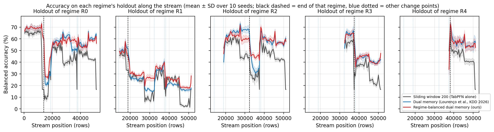
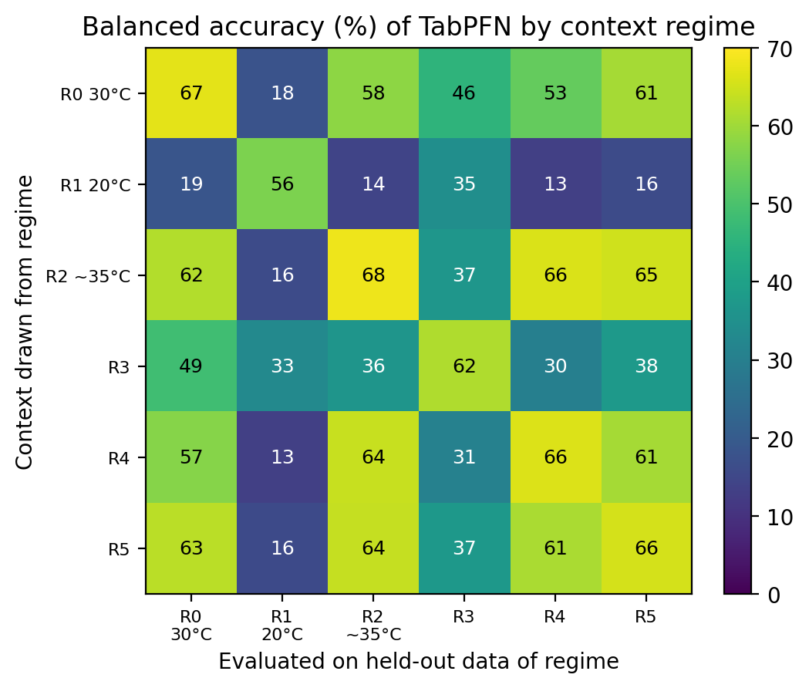

# Round 2：冻结 TabPFN 在概念漂移流上的适应与遗忘（Insects，10 seeds，GPU）

预注册见 [phase56_prereg.md](phase56_prereg.md)（含修订 1、2）。本文件报告结果，假设的判定标准全部按预注册执行。

**方法的由来（先说明）：** 预注册最初提出的方法是"按查询路由的阶段存档"（`arch_routed`）。它在 Mac pilot（seed 0，`n_estimators = 1`）上没有通过 go 标准（ADAPT −2.71 pp，限值 −2 pp），因此在主实验之前由修订 1 换成了阶段均衡双记忆 `dual1000_rb`。这个设计是在看到 pilot 中 KDD 双记忆丢失 R1（R1 上的保留只有 23.3 %）之后提出的。pilot 的 seed 0 也是主实验 10 个 seed 之一（留出集相同，`n_estimators` 不同）。按修订 1 的承诺，`arch_routed` 仍按原 H1–H3 报告，结果在第 4 节。

**一句话结论：** 只用最近 200 行的冻结 TabPFN（`sw200`）在旧阶段留出集上只有 35.1 % 的平衡准确率。KDD 2026 的双记忆（`dual1000`）已经把它提高到 45.9 %（+10.78 pp）。我们只改了淘汰规则的 `dual1000_rb` 再提高 1.42 pp，到 47.3 %（10/10 个 seed 同向，显著），但没有达到预注册的 2 pp 门槛，H3 判为未通过。相对 `sw200`，我们的方法保留 +12.19 pp（H1 通过），适应 +1.16 pp（H2 通过）。

- 所有数字都由脚本从 169 个原始结果文件（npz）重算，并做过交叉核对。原始 npz 文件较大，没有放进仓库；逐 seed 的汇总在 [round2_per_seed.csv](round2_per_seed.csv)。指标的实现见 `src/eval/round2_metrics.py`，汇总与判定由 `scripts/analyze_round2.py` 完成，图和 CSV 由 `scripts/plot_round2.py` 生成
- ± 是 10 个 seed 之间的样本标准差（ddof = 1）。差值检验都是配对检验
- 准确率一律为**平衡准确率**（6 类的召回率取平均），随机猜测是 16.7 %

## 1. 设置

**数据。** Insects `abrupt_balanced`（Souza et al. 2020），共 52,848 行，33 个特征，6 个类。官方变点 14352 / 19500 / 33240 / 38682 / 39510 把数据切成 R0–R5 六个阶段（R0 30 °C，R1 20 °C，R2 约 35 °C，其余论文未注明）。每个 seed 从每个阶段的**整个范围**里按类别分层随机抽出留出集（每类 50 行，R4 每类 20 行，共 1620 行）。留出集从数据流中移除，永远不进入上下文。剩下的数据流有 51,228 行，变点在流内坐标是 14052 / 18900 / 32340 / 37482 / 38190。

**协议。** 批量增量的 prequential 评估：从第 200 行开始，每次用已揭示的行构造上下文，预测接下来 50 行（S = 50），然后揭示标签、更新记忆。批次不跨越官方变点。每 500 行和每个阶段结束时设一个检查点，用方法**当前**的记忆预测所有已出现过的阶段（包括当前阶段）的留出集。检查点不改变记忆，每次检查都核对记忆摘要。

**模型。** TabPFN（tabpfn 6.4.1 的默认权重），权重始终冻结，`n_estimators = 4`，`random_state = seed`。seed 0–9 决定三件事：留出集的抽样、TabPFN 的随机状态、`arch_*` 方法的存档抽样。数据流的阶段顺序是固定的。

**指标。**

| 指标 | 含义 |
|---|---|
| ADAPT | 数据流上全部被预测行的平衡准确率（适应能力） |
| ADAPT (masked) | 同上，但剔除"同一标签连续 ≥ 30 行"的单类长段（见第 2 节） |
| RET | 对每个已结束的阶段 j < 5，取阶段 j 结束之后所有检查点上的留出准确率的平均，再对 j 取平均（保留能力，预注册的主要指标） |
| POST_d | 变点 d 之后前 500 行的平衡准确率（漂移后恢复） |
| FGT_j | 阶段 j 留出集的最佳准确率减去最终准确率（遗忘量，越小越好）。"最佳"可以来自阶段进行中的检查点 |

**方法。**

| 名称 | 上下文 |
|---|---|
| `sw{100…2000}` | 最近 N 行（`sw200` = TabPFN 单独使用，主基线） |
| `dual1000` | Lourenço et al.（KDD 2026）的双记忆：750 行短期 FIFO + 250 行长期池，长期池满时淘汰"数量最多的类别中最老的一行"（论文算法 1） |
| `dual400` | 同上，共 400 行 |
| `cbfifo400` | 每类最近的 ≤ 66 行 |
| `arch_union` | `sw200` + 所有已结束阶段的存档（每阶段每类 25 行） |
| `arch_routed`、`arch_routed_adwin` | `sw200` + 与查询最像的那个阶段的存档（kNN 路由；后者用 ADWIN 切阶段） |
| **`dual1000_rb`（我们的方法）** | 结构与 `dual1000` 完全相同，只改长期池的淘汰规则：先找长期池中行数最多的**阶段**，再在该阶段中找行数最多的类别，淘汰其中最老的一行。阶段边界取官方变点 |
| `dual1000_rb_adwin` | 同上，但阶段边界由 river ADWIN 在方法自身的逐行错误上报警得到（δ = 0.002，冷却 300 行，最短阶段 500 行） |

**与 KDD 论文设置的差别。** KDD 论文对总容量 M ∈ {600, 800, 1000} 和短期比例 {0.65, 0.75, 0.85} 做网格搜索，报告的是网格上的平均。它逐行 prequential，预热 100 行，使用第一版 TabPFN，ensemble 为 4。本文取网格中的 M = 1000、短期比例 0.75，按本协议改为每批 50 行，使用 tabpfn 6.4.1 的权重。预注册把这一组写成"论文的设置"，准确地说是论文网格中的一组。

## 2. 结果可信度

- **硬件与环境：** NVIDIA RTX 2060 Max-Q（6 GB），WSL2，torch 2.10.0+cu128，tabpfn 6.4.1，scikit-learn 1.3.2，numpy 1.26.4，river 0.23.0。在 64 个样本上 GPU 与 CPU 的概率最大差 4.49e-03，预测 100 % 一致。pytest 236 passed，2 skipped
- **GPU 复现闸门：** 在 GPU 上用 `n_estimators = 1` 重跑 Mac pilot 的 seed 0，结果与 Mac 对比：

  | 方法 | 流预测一致率 | 检查点一致率 | ADAPT GPU / Mac | RET GPU / Mac |
  |---|---|---|---|---|
  | `sw200` | 99.58 % | 99.46 % | 75.54 / 75.56 | 34.80 / 34.79 |
  | `dual1000_rb` | 99.45 % | 99.33 % | 76.56 / 76.49 | 47.35 / 47.34 |

- **完整性：** 每一批运行结束后，校验脚本都核对过全部结果文件（文件齐全、`device = cuda`、预测数正确）。这些校验和上面的复现闸门用的是专为那台 GPU 机器写的工具，不在公开仓库里；`scripts/analyze_round2.py` 每次汇总时会重新检查各方法的数据流与留出集是否一致、代码版本和设备是否统一、有没有泄漏或超出上下文预算。168 个流式结果文件的上下文泄漏计数全部为 0，并且都由同一版本的代码生成。各 run 的耗时合计 91.3 GPU 小时
- **数据特征：** 前四个官方变点之前都紧挨着一段单类长段（seed 0 的流内坐标：12336–14052、18828–18900、32247–32340、36976–37482）。数据流末尾还有一段（seed 0：50426–51228；各 seed 为 799–809 行）。第五个变点（38190）之前的单类段只有 25–32 行，只在 4 个 seed 上达到 30 行而被剔除。上下文只含一个类时，预测只能是这个类，平衡准确率掉到 1/6 = 16.7 %。图 4 里 `sw200` 曲线上突然掉到约 17 % 的尖谷就是这个原因。因此 ADAPT 和 POST 都同时报告剔除长段后的版本，RET 的剔除版见第 3 节末尾

## 3. 主结果

| 方法 | ADAPT | ADAPT (masked) | RET | FGT 均值 |
|---|---|---|---|---|
| `sw100` | 73.70 ± 0.12 | 71.47 ± 0.13 | 33.81 ± 0.52 | 44.1 |
| **`sw200`**（基线） | 75.68 ± 0.07 | 73.54 ± 0.08 | 35.08 ± 0.58 | 46.1 |
| `sw300` | 76.40 ± 0.07 | 74.37 ± 0.08 | 35.92 ± 0.57 | 47.9 |
| `sw400` | 76.75 ± 0.06 | 74.85 ± 0.07 | 36.54 ± 0.56 | 49.2 |
| `sw600` | 77.14 ± 0.07 | 75.42 ± 0.07 | 37.51 ± 0.56 | 51.4 |
| `sw1000` | 76.99 ± 0.08 | 75.57 ± 0.09 | 39.76 ± 0.60 | 38.5 |
| `sw1500` | 76.43 ± 0.07 | 75.44 ± 0.08 | 41.03 ± 0.63 | 34.9 |
| `sw2000` | 75.51 ± 0.05 | 74.88 ± 0.04 | 42.11 ± 0.65 | 35.6 |
| `dual400` | 76.11 ± 0.10 | 74.19 ± 0.12 | 43.82 ± 0.89 | 21.6 |
| **`dual1000`**（KDD 2026） | 76.65 ± 0.06 | 75.07 ± 0.07 | 45.86 ± 0.81 | 21.4 |
| **`dual1000_rb`**（我们的） | 76.84 ± 0.06 | 75.29 ± 0.06 | 47.27 ± 0.65 | 20.1 |
| `dual1000_rb_adwin` | 76.88 ± 0.09 | 75.52 ± 0.09 | 46.45 ± 0.86 | 22.5 |
| `cbfifo400` | 67.97 ± 0.19 | 68.21 ± 0.16 | 46.47 ± 1.14 | 19.7 |
| `arch_union` | 72.52 ± 0.53 | 70.40 ± 0.56 | 52.45 ± 0.93 | 12.4 |
| `arch_routed` | 72.44 ± 0.44 | 70.21 ± 0.45 | 45.49 ± 1.44 | 17.0 |
| `arch_routed_adwin` | 72.28 ± 0.34 | 70.67 ± 0.40 | 45.33 ± 1.20 | 15.5 |

不用 TabPFN 的两个基线（10 个 seed 的均值）：No-Change（上一行的标签）29.04 %，最近 200 行的多数类 31.79 %。


**图 1** 适应–保留前沿（误差棒为 10 个 seed 的 ±1 标准差；滑动窗口各点的标准差 ≤ 0.65，图上省略）。灰线是滑动窗口从 100 到 2000 行：窗口越大保留越多，但 ADAPT 在 600 行处见顶后下降。我们的方法在帕累托前沿上：没有任何方法在两个指标上都不差于它。`arch_union` 的保留更高（52.45），但适应低 4.3 pp；`sw600`、`sw1000` 和 ADWIN 版的 ADAPT 略高，但保留更低。右上角的小图放大了三种双记忆。

关键配对比较（10 个 seed；括号内是差值为正的 seed 数，p 为双侧配对 t 检验）：

| 比较 | ΔRET (pp) | ΔADAPT (pp) | ΔADAPT masked (pp) |
|---|---|---|---|
| `dual1000_rb` − `sw200` | +12.19（10/10，t = 107.5） | +1.16（10/10） | +1.75（10/10） |
| `dual1000` − `sw200` | +10.78（10/10） | +0.97（10/10） | +1.53（10/10） |
| `dual1000_rb` − `dual1000` | +1.42（10/10，t = 11.8，p = 8.6e-7） | +0.19（10/10） | +0.22（10/10） |
| `dual1000_rb_adwin` − `dual1000` | +0.59（9/10，t = 4.9，p = 8.7e-4） | +0.23（10/10） | +0.46（10/10） |
| `dual1000_rb` − `arch_union` | −5.17（0/10） | +4.31（10/10） | +4.89（10/10） |
| `dual1000_rb` − `cbfifo400` | +0.81（8/10） | +8.87（10/10） | +7.08（10/10） |

**RET 的剔除版：** 有些检查点的最近 200 行全是一个类（每个 seed 7 个），去掉这些检查点后，`dual1000_rb` − `sw200` 从 +12.19 降到 +10.95 pp，`dual1000` − `sw200` 从 +10.78 降到 +9.52 pp，`dual1000_rb` − `dual1000` 几乎不变（+1.43 pp），三者都是 10/10。H1 的结论不变。

## 4. 预注册假设的判定

H1 和 H3 用单侧配对 t 检验，并要求至少 9/10 个 seed 的差值为正。H2 按修订 2：对"ADAPT 差 + 0.5 pp"做单侧单样本 t 检验，取原始版与 masked 版中较大的 p，并要求至少 9/10 个 seed 的差值 > −0.5 pp。三个主要假设一起做 Holm 校正，α = 0.05。

| 假设 | 内容 | 结果 | 判定 |
|---|---|---|---|
| **H1** | RET(`dual1000_rb`) − RET(`sw200`) ≥ 5 pp 且显著 | +12.19 pp，10/10，p_holm = 4.0e-15 | **通过** |
| **H2** | ADAPT 非劣：单侧 95 % 下界 > −0.5 pp（原始和 masked 都要） | +1.16（下界 +1.08）；masked +1.75（下界 +1.67）；p_holm = 1.5e-11 | **通过** |
| **H3** | RET(`dual1000_rb`) − RET(`dual1000`) ≥ 2 pp 且显著 | +1.42 pp，10/10，p_holm = 4.3e-7 | **未通过**（显著，但低于 2 pp 门槛） |
| H4 | 漂移后 500 行：19500、38682 之后比 `sw200` 高 ≥ 5 pp；14352、39510 之后在 ±2 pp 内 | −6.68、−8.07；−4.21、+0.68 | **未通过**（只有 39510 这一条阴性对照满足） |
| H5 | 没有任何窗口大小在 ADAPT 和 RET 上同时不差于 `dual1000_rb` | 没有 | **通过** |
| H6 | RET(`dual1000_rb`) − RET(`cbfifo400`) ≥ 2 pp | +0.81 pp | **未通过** |
| H7 | ADAPT(`dual1000_rb`) − ADAPT(`dual1000`) ≥ −0.5 pp | +0.19 pp | **通过** |
| H8 | ADWIN 版至少保留一半的 H1 增益，并通过 H2 | RET 增益 +11.37 pp（官方切点版 +12.19）；ADAPT 下界 +1.11 / +1.89（masked） | **通过** |

**未通过的假设怎么表述。** 预注册中 H3 的备用表述（"用约三分之一的上下文达到 KDD 双记忆的保留"）是为 `arch_routed` 写的，修订 1 之后不再适用。H6 没有预设备用表述。这里只如实报告：在相同的 1000 行预算下，我们的保留比 KDD 双记忆高 1.42 pp，适应不降（H7）。只用 400 行的 `cbfifo400` 保留与我们相近（差 0.81 pp），但适应低 8.87 pp。H4 的预期（旧阶段能帮助新阶段起步）原本是为路由方法写的。

**原方法 `arch_routed` 按原 H1–H3：** RET 比 `sw200` 高 10.41 pp（H1 的数值条件满足），但 ADAPT 比 `sw200` 低 3.24 pp（H2 未通过），RET 比 `dual1000` 低 0.37 pp（H3 未通过）。

## 5. 机制：长期池里到底留住了什么

`dual1000` 和 `dual1000_rb` 的淘汰规则只依赖标签和阶段号，与 TabPFN 的预测无关。所以可以不调用 TabPFN，只回放记忆本身，逐批记录 250 行长期池里各阶段各占多少行（seed 0）。


**图 2** 长期池的组成随时间的变化。左：KDD 双记忆只按类别均衡，旧阶段在结束后 1,108–7,900 行内被完全挤出长期池（R0 +4,150，R1 +3,200，R2 +1,350，R3 +1,108，R4 +7,900 行），**数据流结束时 250 行全部来自 R5**。右：我们的方法按"阶段 × 类别"均衡，每个旧阶段的份额随阶段数增加而下降（R1：125 → 83 → 63 → 42 行），结束时 R0–R5 各占 41–42 行。

**KDD 双记忆为什么已经比 `sw200` 好那么多。** 它的长期池在数据流后段只保存最近的一两个阶段，所以相对 `sw200` 的 +10.78 pp 不是来自长期保存旧阶段。更长的上下文只能解释一小部分：同样 1000 行的 `sw1000` 只比 `sw200` 高 4.68 pp，而只有 400 行、按类别均衡的 `cbfifo400` 高 11.39 pp。我们推测主要来源是**类别覆盖**。`sw200` 的上下文在 43 % 的检查点上至少缺一个类（seed 0；`sw1000` 为 24 %），缺失类别的召回必然为 0；类别均衡的记忆保证 6 类都在。旧数据在漂移后滞留 1,108–7,900 行、以及阶段重现（见图 5）可能也有贡献。以上是推断，没有做消融。

**各旧阶段的保留（RET_Rj，%）：**

| 方法 | R0 | R1 | R2 | R3 | R4 |
|---|---|---|---|---|---|
| `sw200` | 41.2 | 19.6 | 41.0 | 30.4 | 43.1 |
| `dual1000` | 53.2 | 23.5 | 52.6 | 43.2 | 56.8 |
| `dual1000_rb` | 54.1 | 27.4 | 55.4 | 43.0 | 56.5 |
| `dual1000_rb` − `dual1000` | +0.87（10/10） | **+3.95（10/10）** | **+2.76（10/10）** | −0.12（4/10） | −0.38（2/10） |


**图 3** 各旧阶段的保留（10 个 seed 的均值 ± 标准差）。

我们的方法相对 KDD 的增益集中在 R1 和 R2。R1（20 °C）几乎不能与其他阶段互相迁移：用其他阶段的上下文预测 R1 只有 13–33 %，接近随机的 16.7 %。KDD 双记忆在 R1 结束 3,200 行后就不再保存 R1 的数据，我们的方法一直保留着它的份额。R3 上两者无差别（−0.12，4/10），R4 上我们的方法略低（−0.38，7/10 个 seed 为负，1 个持平）。R3 是一个反例：KDD 在 R3 结束 1,108 行后就把它挤出了长期池，R3 与 R0 以外的阶段迁移也很差（30–38 %），但我们的方法在 R3 上没有增益，原因尚不清楚。

**代价：当前阶段略差。** 在 R1、R2、R5 进行期间，我们的方法在当前阶段自己的留出集上比 KDD 双记忆低 2.37 / 3.73 / 1.80 pp（三者都是 10/10 个 seed 为负）。R3、R4 期间分别为 −0.38（6/10 为负）和 +1.28（7/10 为正）。一个可能的原因是长期池把名额让给了旧阶段。RET 只看已结束的阶段，ADAPT 看的是流上的预测，两者都不直接反映这一点。



**图 4** 每个阶段的留出集准确率随数据流的变化（10 个 seed 的均值 ± 标准差；黑色虚线是该阶段结束的位置，蓝色点线是其他变点）。阶段结束后，`sw200`（深灰）很快掉下去，两种双记忆都保留得更多。R1 结束后的 69 个检查点中，红线在 62 个上高于蓝线。R2 上的优势集中在 33,540–37,482 行（+6 到 +14 pp），到 38,190 行仍有 +2.5 到 +4.8 pp，此后两条线交替领先；R2 进行期间红线低于蓝线，也就是上面说的当前阶段代价。



**图 5** 迁移矩阵：从阶段 i 中按类别均衡随机抽 198 行（每类 33 行，取自整个阶段）作上下文，预测阶段 j 的留出集（10 个 seed 均值，`n_estimators = 4`）。对角线是 56–68 %。R1 那一行和那一列都很低（13–35 %），R0、R2、R4、R5 之间相互迁移得很好（53–66 %）。这个矩阵分不清 R1 的差别来自特征平移（温度改变了特征）还是类别边界本身的改变。

## 6. 漂移刚发生后的恢复

**漂移后 500 行的平衡准确率（POST，%；全部方法见附录 A）：**

| 方法 | 14352 | 19500 | 33240 | 38682 | 39510 |
|---|---|---|---|---|---|
| `sw200` | 47.40 | 51.62 | 51.31 | 56.09 | 65.53 |
| `sw1000` | 45.33 | 44.36 | 50.11 | 45.67 | 61.36 |
| `sw2000` | 44.20 | 40.41 | 47.38 | 41.79 | 68.17 |
| `dual1000` | 43.18 | 42.11 | 46.89 | 45.54 | 64.33 |
| `dual1000_rb` | 43.18 | 44.94 | 52.26 | 48.01 | 66.21 |

上下文越大，漂移刚发生时越慢。在 5 个变点中的 3 个，`dual1000_rb` 比 `sw200` 低 4–8 pp（H4 未通过）；同样 1000 行的 `sw1000` 和 2000 行的 `sw2000` 在 19500 和 38682 之后也都明显低于 `sw200`。这一劣势不只是前几十行：14352 之后的第 500–1000 行，`dual1000_rb` 仍是 44.1 %，`sw200` 是 52.0 %。R4 只有 708 行，几乎整段都处在这一劣势中（R4 第 250–500 行：57.7 % 对 66.3 %）。整条数据流的 ADAPT 仍然是双记忆更高。

与 `dual1000` 相比，我们的方法在后四个变点之后都更高（+2.83 / +5.37 / +2.47 / +1.88 pp，分别 10/10、10/10、10/10、9/10）。两种方法的长期池要等新阶段的行进入长期池（seed 0 在第 14,802 行，变点后约 750 行）才开始不同。在此之前溢出到长期池的只有 R0 的行，两条淘汰规则的结果完全相同。这发生在 POST_0 的 500 行窗口之后，所以 POST_0 完全相等。

剔除单类长段后，所有方法的 POST 都与上表完全相同（这五个 500 行窗口里没有长段）。剔除只影响计分，不影响上下文：变点前的单类长段在漂移发生时仍占着 `sw200` 的窗口和 750 行的短期 FIFO。

## 7. 不知道官方变点时：ADWIN 版

`dual1000_rb_adwin` 在每个 seed 上报警 13–15 次。把 10 个 seed 的报警按位置聚类（流内坐标），有 12 处在全部 10 个 seed 上都出现，另有 27704–28061 出现在 8 个 seed 上，其余 6 处各只出现在 1–3 个 seed 上。ADWIN 对错误率上升和下降都会报警。下面用 seed 0 的方法自身错误率（报警前 300 行 → 报警后 300 行）说明各处报警的性质：

| 报警位置（10 个 seed） | 相对官方变点 | seed 0 错误率 | 性质 |
|---|---|---|---|
| 14063–14064 | 14052 +11~+12 | 0.04 → 0.55 | 检出变点 |
| 18918–18920 | 18900 +18~+20 | 0.04 → 0.47 | 检出变点 |
| 32389–32419 | 32340 +49~+79 | 0.31 → 0.46 | 检出变点 |
| 37142–37257 | 37482 之前 225–340 行 | 0.24 → 0.09 | 落在单类长段内，错误率下降 |
| 37855–38328 | 37482 之后 373–846 行（38190 −335~+138） | 0.44 → 0.35 | 37482 之后的恢复期，错误率下降 |
| 19458–19677 | 18900 之后 558–777 行 | 0.29 → 0.19 | 变点后的恢复期 |
| 12356–12365、50434–50444 | — | — | 单类长段开头附近（长段从 12336 和 50426 开始） |
| 17376–17385、17972–18191、27173–27191、45309–45327 | — | — | 阶段内部，论文未记录 |

所以按错误率上升来算，ADWIN 只检出了前三个官方变点（11–79 行之内）。最后两个变点相距只有 708 行，附近的报警来自单类长段和变点后的恢复期。

阶段切得更碎，长期池就分得更散，这可能是 ADWIN 版保留较低的原因（未单独验证）：它比官方切点版低 0.83 pp，但仍比 KDD 双记忆高 0.59 pp（9/10），比 `sw200` 高 11.37 pp（10/10）。它的 ADAPT 是 76.88（masked 75.52），与官方切点版相当。

## 8. 敏感性：每批 10 行（S = 10，seed 0–2）

| S | `sw200` ADAPT / RET | `dual1000_rb` ADAPT / RET | ΔRET | ΔADAPT |
|---|---|---|---|---|
| 50 | 75.66 / 35.40 | 76.81 / 47.61 | +12.21 | +1.15 |
| 10 | 75.93 / 35.28 | 77.04 / 47.57 | +12.29 | +1.11 |

批次从 50 行降到 10 行，增益几乎不变（3 个 seed 都同向）。

## 9. 其他观察

- **把所有存档都放进上下文（`arch_union`）保留最多（52.45），但适应能力低 4.3 pp。** 一个可能的原因是来自其他阶段、迁移很差的旧数据（例如 R1）干扰了当前阶段。另一个更简单的解释是：后段 750 行的存档在数量上压过了 200 行的当前窗口。我们没有做去掉 R1 存档的消融
- **按查询路由（`arch_routed`）失败：** 38.1 % 的数据流行被路由到某个旧存档（ADWIN 版 51.6 %），ADAPT 比 `sw200` 低 3.2 pp。这与修订 1 记录的 pilot 现象一致
- **FGT 对最后一个检查点很敏感：** 数据流末尾约 800 行的单类长段，让 ≤ 600 行的窗口在最终检查点只能输出一个类（10/10 个 seed），所以 `sw600` 的 FGT（51.4）比 `sw1000`（38.5）还大。RET 是预注册的主要保留指标，FGT 只作参考（各阶段的 FGT 见附录 A）

## 10. 局限

- **一个数据集，一条数据流。** 10 个 seed 共享同一个阶段顺序，只改变留出集抽样和 TabPFN 的随机状态。文中很小的 p 值（如 4e-15）只反映这两种随机性，不代表结论能推广到别的数据流
- **方法是在 pilot 之后提出的**（见开头），并且 pilot 的 seed 0 也在主实验中
- **预算不同。** 双记忆用 1000 行上下文，`sw200` 只用 200 行。单个 run 的耗时分别约为 31 和 14 分钟；同为 1000 行的 `sw1000` 约 33 分钟，是等预算的参照
- **官方变点在 ADWIN 版中仍然起作用：** 批次按官方变点对齐，留出集和 RET 也按官方阶段定义。ADWIN 只替代了记忆里的阶段划分
- **思路并不新。** 持续学习中按任务或类别均衡的回放缓冲区早已有之（如 Chaudhry et al. 2019 的 ring buffer，Chrysakis & Moens 2020 的 CBRS）。本文的贡献是把这一思路用于冻结 TabPFN 的上下文选择，并且同时测量适应与保留
- **没有非 TabPFN 的流学习器**（如 ARF、SRP）作对照；KDD 论文有这类对照。本文只有 No-Change 和多数类两个平凡基线
- **短期/长期比例固定为 75 / 25**，没有扫描
- **对 KDD 双记忆的改进很小**（+1.42 pp，未达预注册门槛），主要集中在 R1 和 R2，并且以当前阶段 1.8–3.7 pp 的下降为代价（R1、R2、R5 期间）
- 迁移矩阵用 198 行类别均衡的上下文，只说明阶段之间的相对关系，不等于主实验的设置

## 11. 复现

```bash
# 单个 run（GPU）
python scripts/run_round2.py --method dual1000_rb --seed 0 --n_estimators 4 --device cuda
# 批量（结果已存在就跳过）
python scripts/run_round2_multiseed.py --methods sw200,dual1000,dual1000_rb --seeds 0-9 --n_parallel 2 --device cuda
# 汇总表与假设判定
python scripts/analyze_round2.py --dir results/round2 --n_estimators 4
# 本文的图与逐 seed 汇总 CSV
python scripts/plot_round2.py --dir results/round2 --out results/figures_round2 --csv results/round2_per_seed.csv
```

原始 npz 文件没有放进仓库，可以用上面的命令重新生成；文中所有逐 seed 的指标都在 [round2_per_seed.csv](round2_per_seed.csv) 里。

## 附录 A：全部方法的漂移后恢复与各阶段遗忘量

**POST（漂移后 500 行，%，10 个 seed 均值；剔除单类长段后数值完全相同）：**

| 方法 | 14352 | 19500 | 33240 | 38682 | 39510 |
|---|---|---|---|---|---|
| `sw100` | 47.3 | 52.9 | 49.1 | 58.6 | 50.2 |
| `sw200` | 47.4 | 51.6 | 51.3 | 56.1 | 65.5 |
| `sw300` | 46.7 | 51.5 | 51.1 | 55.0 | 63.5 |
| `sw400` | 46.2 | 49.9 | 52.0 | 53.7 | 52.4 |
| `sw600` | 45.7 | 45.8 | 49.8 | 51.7 | 63.5 |
| `sw1000` | 45.3 | 44.4 | 50.1 | 45.7 | 61.4 |
| `sw1500` | 45.1 | 43.1 | 49.3 | 43.0 | 68.5 |
| `sw2000` | 44.2 | 40.4 | 47.4 | 41.8 | 68.2 |
| `dual400` | 45.9 | 48.2 | 50.9 | 55.4 | 57.9 |
| `dual1000` | 43.2 | 42.1 | 46.9 | 45.5 | 64.3 |
| `dual1000_rb` | 43.2 | 44.9 | 52.3 | 48.0 | 66.2 |
| `dual1000_rb_adwin` | 44.6 | 43.6 | 52.7 | 48.8 | 65.0 |
| `cbfifo400` | 47.9 | 44.0 | 46.8 | 55.7 | 62.2 |
| `arch_union` | 42.6 | 52.0 | 50.8 | 55.4 | 67.9 |
| `arch_routed` | 44.6 | 50.6 | 49.0 | 50.4 | 63.0 |
| `arch_routed_adwin` | 44.7 | 50.5 | 50.2 | 51.8 | 60.7 |

**FGT_j（最佳 − 最终留出准确率，%，越小越好）：**

| 方法 | R0 | R1 | R2 | R3 | R4 | 平均 |
|---|---|---|---|---|---|---|
| `sw100` | 51.6 | 31.5 | 48.3 | 41.8 | 47.3 | 44.1 |
| `sw200` | 52.2 | 35.0 | 48.2 | 44.1 | 50.8 | 46.1 |
| `sw300` | 52.7 | 38.7 | 48.8 | 46.3 | 53.0 | 47.9 |
| `sw400` | 53.3 | 39.5 | 50.6 | 48.3 | 54.6 | 49.2 |
| `sw600` | 54.4 | 42.7 | 53.7 | 49.5 | 56.6 | 51.4 |
| `sw1000` | 30.8 | 54.0 | 32.6 | 43.4 | 31.8 | 38.5 |
| `sw1500` | 27.9 | 49.8 | 32.5 | 35.5 | 28.7 | 34.9 |
| `sw2000` | 28.4 | 52.0 | 32.8 | 36.9 | 27.9 | 35.6 |
| `dual400` | 14.2 | 38.6 | 11.7 | 25.4 | 18.2 | 21.6 |
| `dual1000` | 13.1 | 39.8 | 12.8 | 26.1 | 15.2 | 21.4 |
| `dual1000_rb` | 17.4 | 29.5 | 14.5 | 18.8 | 20.4 | 20.1 |
| `dual1000_rb_adwin` | 20.3 | 27.3 | 19.6 | 18.8 | 26.3 | 22.5 |
| `cbfifo400` | 8.2 | 43.3 | 7.2 | 30.3 | 9.7 | 19.7 |
| `arch_union` | 9.2 | 20.1 | 11.0 | 8.9 | 12.8 | 12.4 |
| `arch_routed` | 22.2 | 12.6 | 17.3 | 12.1 | 20.8 | 17.0 |
| `arch_routed_adwin` | 15.9 | 20.9 | 11.1 | 15.1 | 14.8 | 15.5 |
